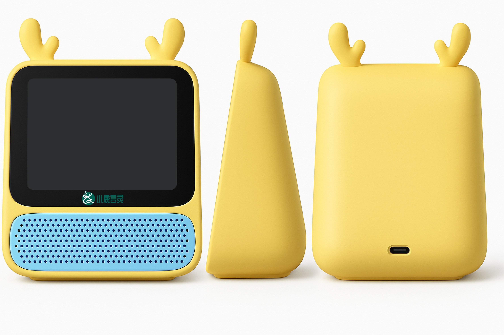

# 小鹿精灵 AI作业辅导助手 （Xiaolu AI Homework Assistant）

（中文 | [English](README_en.md) )

## 产品官网

👉 http://xiaoluyanling.com/

## 项目目的

本项目由深圳小鹿言灵技术有限公司开发，是一款基于“小智”开源聊天机器人打造的AI作业辅导产品，旨在探索其在教育场景中的商业应用。

我们希望通过这款产品，帮助缺乏时间、精力或专业知识的小学生家长更轻松地辅导孩子完成作业。通过AI生动、互动式的推演讲解，孩子能够更好地理解和巩固课堂知识。

依托大语言模型的快速发展，我们正在将先进的AI技术落地到低成本的智能硬件中，使下沉市场和小镇家庭的孩子们也能无门槛使用前沿科技，为教育的公平竞争贡献力量。

欢迎广大开发者和用户参与项目的建设与优化。如有建议或想法，欢迎随时提交 Issue，与我们共同完善这款产品。

交流微信：reven86

## 上市时间
6月份底完成量产

## 规划功能-大部分已实现

### 1. 作业拍照识别与辅导

* **作业拍照识别**：支持用户用摄像头拍照上传纸质作业，自动识别题目文字与图像内容（OCR+图像识别）。
* **题型智能分类**：根据识别内容，自动判断是语文、数学、英语或其他学科题型，并调用相应AI模块。
* **逐步讲解推演**：AI不会直接给出答案，而是分步讲解、举例分析，帮助孩子理解过程。

---

### 2. 多轮语音对话辅导

* **语音交互支持**：通过语音与机器人对话，模拟一对一辅导老师的教学过程。
* **口语练习功能**：用于英语听说训练，支持评分与发音纠正。
* **鼓励性反馈**：设计具有童趣、激励性质的语音风格，提升学习积极性。

---

### 3. 知识点精讲与巩固

* **错题追踪与讲解**：自动收集用户作业中出错的题目，归纳知识点，并提供专项讲解。
* **知识点微课视频/动画**：每个知识点搭配简短的视频或动画讲解，适合小学生认知水平。
* **AI生成练习题**：根据用户薄弱点，智能生成巩固练习题。

---

### 4. 家长辅助功能

* **学习进度报告**：定期生成孩子学习可视化报告，包括题目完成情况、知识掌握度、学习建议等。
* **家长提示模式**：支持家长用手机远程查看辅导过程，提供“家长提示词”帮助参与孩子学习。
* **学习提醒设置**：自动设置每日学习计划与时间提醒。

---

### 5. 儿童友好界面与交互

* **卡通形象陪伴式互动**：通过拟人化“小鹿精灵”角色，提升亲和力与黏性。
* **成就系统与奖励机制**：完成任务获得虚拟奖励、升级称号等，激发学习动力。
* **沉浸式对话体验**：设计带有“问答闯关”或“故事导学”模式的对话形式。

---

### 6. 软硬件结合功能（用于学习机终端）

* **离线功能支持**：在断网环境下也能完成部分常见题型的答疑与讲解。
* **硬件专属体验优化**：结合学习机的物理按键、触屏、麦克风等，优化交互效率。
* **家庭网络管理**：可限制上网时间、屏蔽非学习内容。

---

### 7. 安全与隐私保护

* **儿童隐私保护协议合规**：遵守《个人信息网络保护规定》。
* **家长监控与数据透明**：家长可查看所有使用记录，AI数据完全可审计。

## 硬件部分

### 硬件外观部分预览图

### 开发环境

- VSCode
- ESP-IDF SDK 版本 5.3 或以上
- Linux
- 使用 Google C++ 代码风格，提交代码时请确保符合规范

