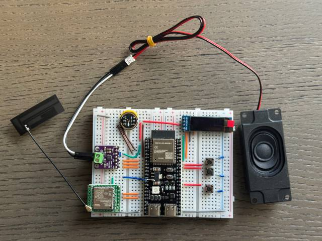
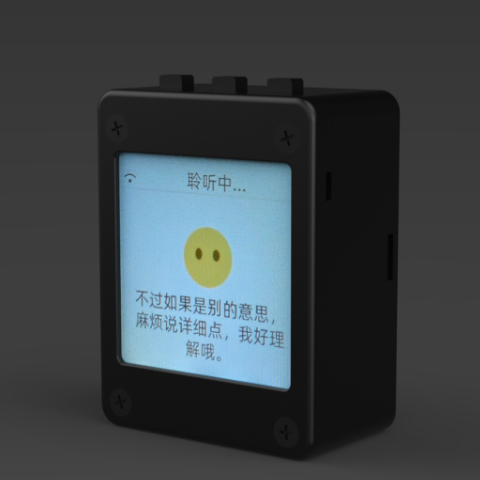

# 小鹿精灵 AI作业辅导机器人 （Xiaolu AI Homework Assistant）

（中文 | [English](README_en.md) )

## 产品官网

👉 http://xiaoluyanling.com/

## 项目目的

本项目是由深圳小鹿言灵技术有限公司开发的一个AI作业辅导机器人产品，是基于小智聊天机器人开源项目的商业实践项目。

我们希望通过这个项目，能够帮助更多时间精力或者专业能力缺乏的小学生家长更好得辅导小孩完成作业，通过AI友好生动的推演讲解，让小孩更好掌握巩固所学知识。
将当下飞速发展的大语言模型应用到实际的硬件设备中，打造低成本的智能学习机成为可能，下沉市场和小镇家庭的孩子们也能无压力用上最新科技产品。

欢迎所有人参与到项目的开发和改进中来。如果你有任何想法或建议，请随时提出 Issue。

交流微信：reven86

## 上市时间
6月份底完成量产

## 规划功能-大部分已实现

### 1. 作业拍照识别与辅导

* **作业拍照识别**：支持用户用摄像头拍照上传纸质作业，自动识别题目文字与图像内容（OCR+图像识别）。
* **题型智能分类**：根据识别内容，自动判断是语文、数学、英语或其他学科题型，并调用相应AI模块。
* **逐步讲解推演**：AI不会直接给出答案，而是分步讲解、举例分析，帮助孩子理解过程。

---

### 2. 多轮语音对话辅导

* **语音交互支持**：通过语音与机器人对话，模拟一对一辅导老师的教学过程。
* **口语练习功能**：用于英语听说训练，支持评分与发音纠正。
* **鼓励性反馈**：设计具有童趣、激励性质的语音风格，提升学习积极性。

---

### 3. 知识点精讲与巩固

* **错题追踪与讲解**：自动收集用户作业中出错的题目，归纳知识点，并提供专项讲解。
* **知识点微课视频/动画**：每个知识点搭配简短的视频或动画讲解，适合小学生认知水平。
* **AI生成练习题**：根据用户薄弱点，智能生成巩固练习题。

---

### 4. 家长辅助功能

* **学习进度报告**：定期生成孩子学习可视化报告，包括题目完成情况、知识掌握度、学习建议等。
* **家长提示模式**：支持家长用手机远程查看辅导过程，提供“家长提示词”帮助参与孩子学习。
* **学习提醒设置**：自动设置每日学习计划与时间提醒。

---

### 5. 儿童友好界面与交互

* **卡通形象陪伴式互动**：通过拟人化“小鹿精灵”角色，提升亲和力与黏性。
* **成就系统与奖励机制**：完成任务获得虚拟奖励、升级称号等，激发学习动力。
* **沉浸式对话体验**：设计带有“问答闯关”或“故事导学”模式的对话形式。

---

### 6. 软硬件结合功能（用于学习机终端）

* **离线功能支持**：在断网环境下也能完成部分常见题型的答疑与讲解。
* **硬件专属体验优化**：结合学习机的物理按键、触屏、麦克风等，优化交互效率。
* **家庭网络管理**：可限制上网时间、屏蔽非学习内容。

---

### 7. 安全与隐私保护

* **儿童隐私保护协议合规**：遵守《儿童个人信息网络保护规定》。
* **家长监控与数据透明**：家长可查看所有使用记录，AI数据完全可审计。

## ✅ 已支持的芯片平台

- ✅ ESP32-S3
- ✅ ESP32-C3
- ✅ ESP32-P4

## 硬件部分

### 面包板手工制作实践

详见飞书文档教程：

👉 [《小智 AI 聊天机器人百科全书》](https://ccnphfhqs21z.feishu.cn/wiki/F5krwD16viZoF0kKkvDcrZNYnhb?from=from_copylink)

面包板效果图如下：

### 已支持的开源硬件

- <a href="https://oshwhub.com/li-chuang-kai-fa-ban/li-chuang-shi-zhan-pai-esp32-s3-kai-fa-ban" target="_blank" title="立创·实战派 ESP32-S3 开发板">立创·实战派 ESP32-S3 开发板</a>
- <a href="https://github.com/espressif/esp-box" target="_blank" title="乐鑫 ESP32-S3-BOX3">乐鑫 ESP32-S3-BOX3</a>
- <a href="https://docs.m5stack.com/zh_CN/core/CoreS3" target="_blank" title="M5Stack CoreS3">M5Stack CoreS3</a>
- <a href="https://docs.m5stack.com/en/atom/Atomic%20Echo%20Base" target="_blank" title="AtomS3R + Echo Base">AtomS3R + Echo Base</a>
- <a href="https://docs.m5stack.com/en/core/ATOM%20Matrix" target="_blank" title="AtomMatrix + Echo Base">AtomMatrix + Echo Base</a>
- <a href="https://gf.bilibili.com/item/detail/1108782064" target="_blank" title="神奇按钮 2.4">神奇按钮 2.4</a>
- <a href="https://www.waveshare.net/shop/ESP32-S3-Touch-AMOLED-1.8.htm" target="_blank" title="微雪电子 ESP32-S3-Touch-AMOLED-1.8">微雪电子 ESP32-S3-Touch-AMOLED-1.8</a>
- <a href="https://github.com/Xinyuan-LilyGO/T-Circle-S3" target="_blank" title="LILYGO T-Circle-S3">LILYGO T-Circle-S3</a>
- <a href="https://oshwhub.com/tenclass01/xmini_c3" target="_blank" title="虾哥 Mini C3">虾哥 Mini C3</a>
- <a href="https://oshwhub.com/movecall/moji-xiaozhi-ai-derivative-editi" target="_blank" title="Movecall Moji ESP32S3">Moji 小智AI衍生版</a>
- <a href="https://oshwhub.com/movecall/cuican-ai-pendant-lights-up-y" target="_blank" title="Movecall CuiCan ESP32S3">璀璨·AI吊坠</a>
- <a href="https://github.com/WMnologo/xingzhi-ai" target="_blank" title="无名科技Nologo-星智-1.54">无名科技Nologo-星智-1.54TFT</a>
- <a href="https://www.seeedstudio.com/SenseCAP-Watcher-W1-A-p-5979.html" target="_blank" title="SenseCAP Watcher">SenseCAP Watcher</a>

  
  
  
  
  
  
  
  
  
  
  
  

## 固件部分

### 免开发环境烧录

新手第一次操作建议先不要搭建开发环境，直接使用免开发环境烧录的固件。

固件默认接入 [xiaozhi.me](https://xiaozhi.me) 官方服务器，目前个人用户注册账号可以免费使用 Qwen 实时模型。

👉 [Flash烧录固件（无IDF开发环境）](https://ccnphfhqs21z.feishu.cn/wiki/Zpz4wXBtdimBrLk25WdcXzxcnNS) 

### 开发环境

- Cursor 或 VSCode
- 安装 ESP-IDF 插件，选择 SDK 版本 5.3 或以上
- Linux 比 Windows 更好，编译速度快，也免去驱动问题的困扰
- 使用 Google C++ 代码风格，提交代码时请确保符合规范

### 开发者文档

- [开发板定制指南](main/boards/README.md) - 学习如何为小智创建自定义开发板适配
- [物联网控制模块](main/iot/README.md) - 了解如何通过AI语音控制物联网设备

## 智能体配置

如果你已经拥有一个小智 AI 聊天机器人设备，可以登录 [xiaozhi.me](https://xiaozhi.me) 控制台进行配置。

👉 [后台操作视频教程（旧版界面）](https://www.bilibili.com/video/BV1jUCUY2EKM/)

## 技术原理与私有化部署

👉 [一份详细的 WebSocket 通信协议文档](docs/websocket.md)

在个人电脑上部署服务器，可以参考另一位作者同样以 MIT 许可证开源的项目 [xiaozhi-esp32-server](https://github.com/xinnan-tech/xiaozhi-esp32-server)

## Star History

<a href="https://star-history.com/#78/xiaozhi-esp32&Date">
 <picture>
   <source media="(prefers-color-scheme: dark)" srcset="https://api.star-history.com/svg?repos=78/xiaozhi-esp32&type=Date&theme=dark" />
   <source media="(prefers-color-scheme: light)" srcset="https://api.star-history.com/svg?repos=78/xiaozhi-esp32&type=Date" />
   
 </picture>
</a>
